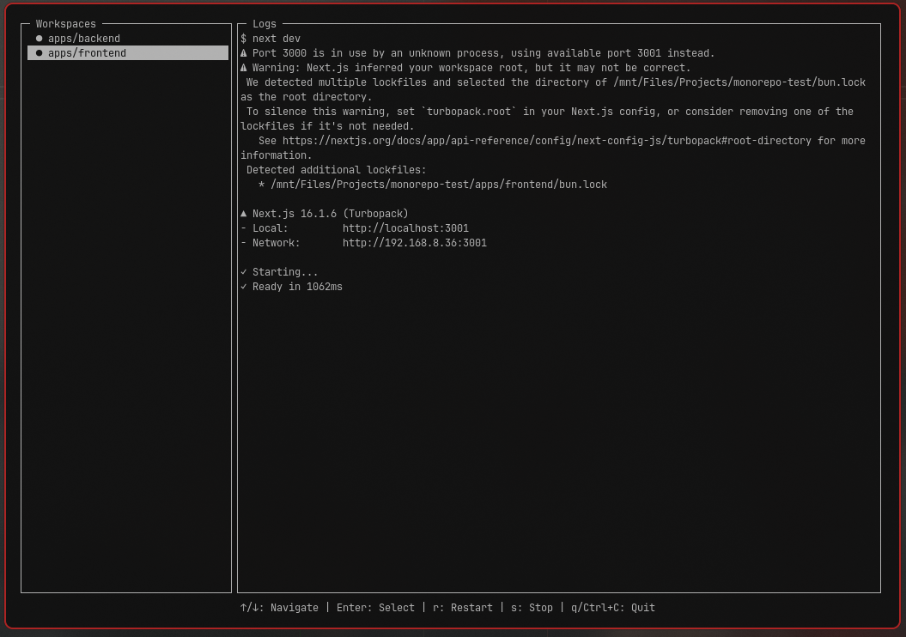

# Bun-Wtui

Neovim-style TUI dashboard for Bun workspaces.

Bun-Wtui is a lightweight terminal UI that lets you navigate your monorepo workspaces from a sidebar and view live logs in a split panel layout. It’s designed for developers who want something simpler than heavy task runners — just clean navigation and logs.

inspired by: [Turborepo](https://turborepo.dev/)

---

## Features

* Sidebar workspace navigation (↑/↓)
* Live log viewer for selected workspace
* Restart selected workspace (`r`)
* Stop selected workspace (`s`)
* Lint dependencies in overlay (`l`)
* Fix dependency mismatches in overlay (`f`)
* Quit instantly (`q` or `Ctrl+C`)
* Auto-detects Bun workspaces from `package.json`
* Running status indicators (● running / — stopped)
* ▌ Active workspace indicator
* Works with any Bun monorepo
* Powered by syncpack for dependency management

---

## Examples


<video src="./examples/example-vid.mp4" controls></video>

## Installation

```bash
bun add -d bun-wtui
```
> recommended to add -d flag as *devDependencies*

Add this to your root `package.json`:

```json
{
  "scripts": {
    "dev": "bun-wtui"
  }
}
```

Then run:

```bash
bun run dev
```

---

## CLI Commands

```bash
bun-wtui {commands}
```

`help`: Show command flags <br>
`tui`: Show deafult tui <br>
`lint`: List workspaces dependencies issues <br>
`fix`: Fix workspaces dependencies issues <br>


---

## How It Works?

BunTUI:

1. Reads your root `package.json`
2. Detects `"workspaces"`
3. Lists them in a sidebar
4. Runs `bun run dev` inside the selected workspace
5. Streams logs to the right panel
6. Lint and Fix dependencies issue comes from `syncpack`

No extra config required.

---

## Controls

| Key    | Action                      |
| ------ | --------------------------- |
| ↑ / ↓  | Navigate workspaces         |
| Enter  | Select workspace            |
| r      | Restart selected workspace  |
| s      | Stop selected workspace     |
| l      | Lint dependencies (overlay) |
| f      | Fix mismatches (overlay)    |
| ESC    | Close overlay               |
| q      | Quit                        |
| Ctrl+C | Quit                        |

---

## Configuration (Optional)

BunTUI works with zero configuration, but you can customize behavior by creating a config file in your project root:

- `bun-wtui.json`
- `.bun-wtui.json`
- `config/bun-wtui.json`

**Example configuration:**

```json
{
  "ui": {
    "theme": "dark",
    "minWidthForLandscape": 80,
    "sidebarWidth": 25,
    "showTimestamps": false
  },
  "workspace": {
    "excludeWorkspaces": [],
    "autoDetectWorkspaces": true
  },
  "syncpack": {
    "dependencyTypes": ["prod", "dev"],
    "autoLintOnStart": false
  },
  "behavior": {
    "logLevel": "normal", // "verbose" | "normal" | "quiet"
    "rememberLastWorkspace": false
  }
}
```

**Config Options:**

| Option | Type | Default | Description |
| ------ | ---- | ------- | ----------- |
| `ui.minWidthForLandscape` | number | 80 | Terminal width threshold for side-by-side layout |
| `ui.sidebarWidth` | number | 25 | Sidebar width percentage in landscape mode |
| `ui.showTimestamps` | boolean | false | Add timestamps to log entries |
| `workspace.excludeWorkspaces` | string[] | [] | Workspace paths to hide from sidebar |
| `syncpack.dependencyTypes` | string[] | ["prod", "dev"] | Dependency types to check |
| `behavior.logLevel` | string | "normal" | Log verbosity (verbose/normal/quiet) |

See [bun-wtui.json.example](./bun-wtui.json.example) for a complete example.

---

## Supported Workspace Format

Example:

```json
{
  "workspaces": [
    "apps/*",
    "packages/*"
  ]
}
```

Each workspace must have a `dev` script:

```json
{
  "scripts": {
    "dev": "next dev"
  }
}
```

---

## Philosophy

BunTUI is not a task graph engine.

It does not cache builds.
It does not optimize pipelines.
It does not manage dependencies.

It simply:

> Shows your workspaces
> Lets you navigate
> Streams logs cleanly

Minimal. Focused. Fast.

---

## Roadmap

* [ ] Memory usage display
* [x] Config file support
* [ ] Custom script flag (`--script build`)
* [ ] Tree-style workspace explorer

---

## 🛠 Development

Build locally:

```bash
bun run test
```

Test:
> run this on a sandbox project

```bash
bun link bun-wtui
```

Run:

```bash
bun bun-wtui
```
---

## Publishing

#### Bump Version

```bash
npm version patch  # 1.0.1 -> 1.0.2
npm version minor  # 1.0.1 -> 1.1.0
npm version major  # 1.0.1 -> 2.0.0
```

#### Publish to npm
```
npm publish
```